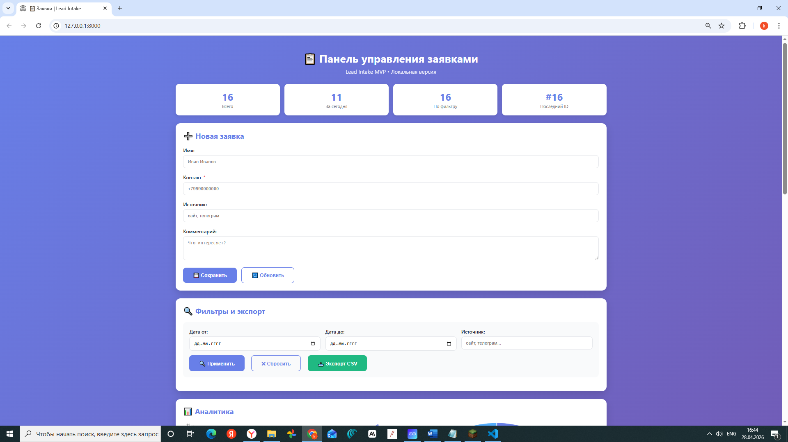
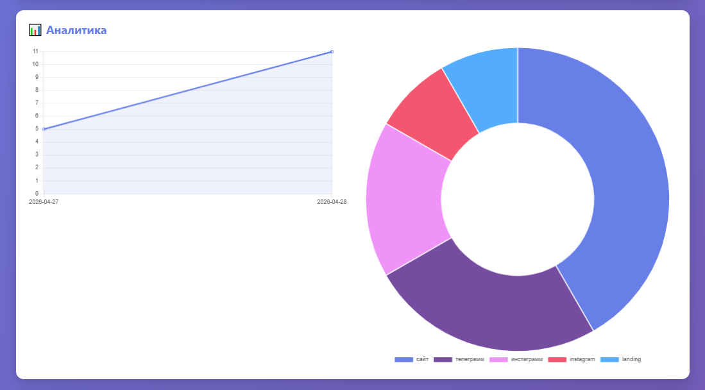
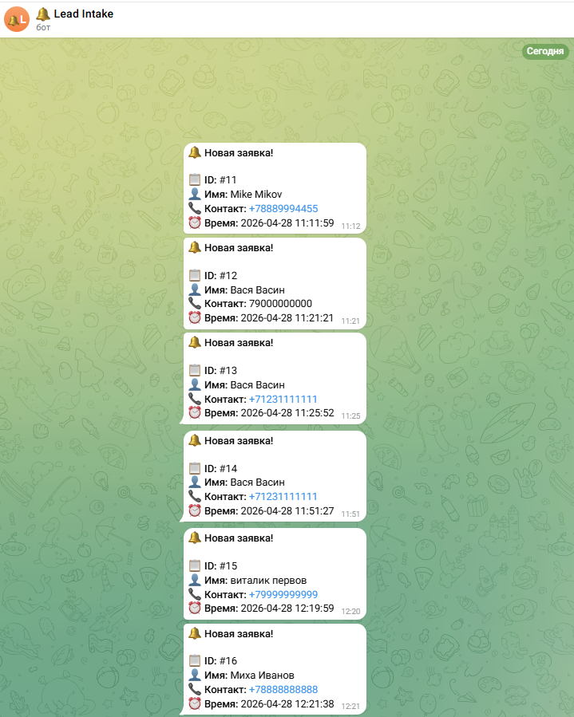
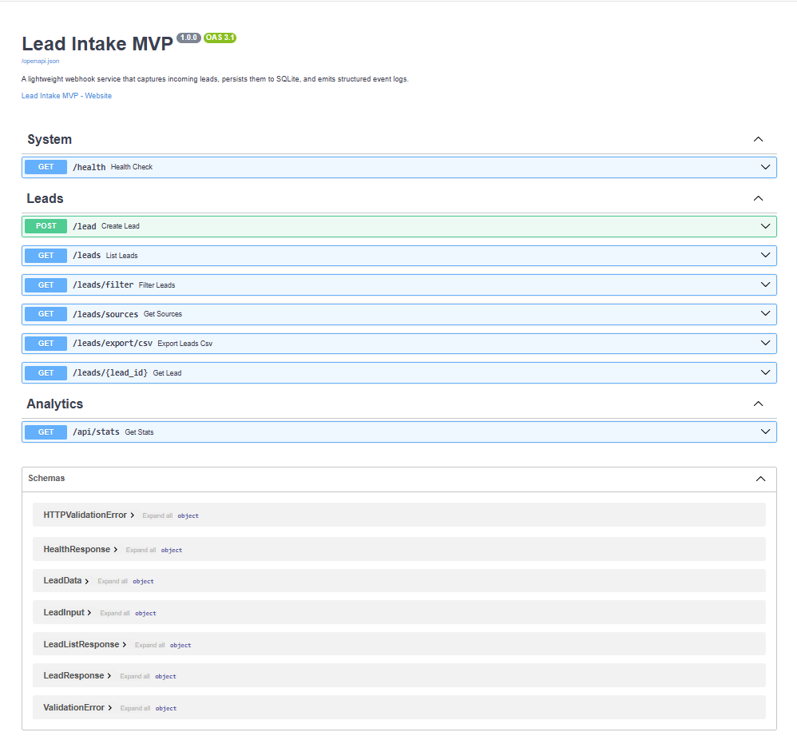

<div align="center">

# 📋 Lead Intake MVP

**Микросервис приёма заявок через webhook**

[](https://python.org)
[](https://fastapi.tiangolo.com)
[](https://sqlite.org)
[](https://docker.com)
[](LICENSE)

*Принимает заявки → сохраняет в SQLite → уведомляет в Telegram → показывает в браузере*

[Возможности](#-возможности) • [Скриншоты](#-скриншоты) • [Быстрый старт](#-быстрый-старт) • [API](#-api) • [Конфигурация](#-конфигурация)

</div>

## 🎯 Кейс

Проблема:

Заявки приходят из разных источников и часто теряются:
лендинги, формы, Telegram, CRM-интеграции.

Решение:

Lead Intake MVP принимает заявки через webhook,
сохраняет их в базу данных и мгновенно уведомляет менеджера.

Результат:

- заявки не теряются;
- есть единая точка хранения;
- менеджер получает уведомление сразу после обращения клиента.

  
## 🏗️ Архитектура

```text
Клиент / CRM / Сайт
          ↓
      POST /lead
          ↓
        FastAPI
          ↓
        SQLite
          ↓
   ┌──────┴──────┐
   ↓             ↓
Telegram      Email
          ↓
      Веб-панель
```


## 👥 Для кого

Подходит для:

- лендингов;
- маркетинговых агентств;
- малого бизнеса;
- Telegram-ботов;
- MVP продуктов;
- внутренних бизнес-систем.

## ✨ Возможности

| Функция | Описание |
|---|---|
| 🔗 **Webhook endpoint** | `POST /lead` — приём заявок от любых внешних сервисов |
| 🗄️ **SQLite хранилище** | Персистентность без лишних зависимостей |
| 📲 **Telegram-уведомления** | Мгновенные уведомления менеджеру при новой заявке |
| 📧 **Email-уведомления** | Резервный канал через Gmail / любой SMTP |
| 🖥️ **Веб-панель** | Дашборд с формой, фильтрами и статистикой |
| 📊 **Аналитика** | Графики по дням и источникам |
| 📥 **Экспорт CSV** | Выгрузка заявок одним кликом |
| 📚 **Swagger UI** | Интерактивная документация «из коробки» |
| 🐳 **Docker** | Запуск одной командой |
| 🔐 **HTTP Basic Auth** | Защита веб-панели логином и паролем |

---

## 📸 Скриншоты

<table>
  <tr>
    <td align="center" width="50%">
      <b>🖥️ Панель управления</b><br><br>
      
    </td>
    <td align="center" width="50%">
      <b>📊 Аналитика</b><br><br>
      
    </td>
  </tr>
  <tr>
    <td align="center" width="50%">
      <b>📲 Telegram-уведомления</b><br><br>
      
    </td>
    <td align="center" width="50%">
      <b>📚 Swagger API Docs</b><br><br>
      
    </td>
  </tr>
</table>

> 🎬 **Демо:** [demo.gif](docs/demo.gif)

---

## 🚀 Быстрый старт

### Вариант 1 — Docker (рекомендуется)

```bash
# 1. Клонировать репозиторий
git clone https://github.com/KirillTomenko/lead-intake-mvp.git
cd lead-intake-mvp

# 2. Настроить переменные окружения
cp .env.example .env
# отредактировать .env (Telegram токен, пароль и т.д.)

# 3. Запустить
docker compose up -d

# Сервис доступен на http://localhost:8000
```

### Вариант 2 — локально (без Docker)

```bash
# 1. Создать виртуальное окружение
python -m venv venv
source venv/bin/activate        # Linux / macOS
# venv\Scripts\activate         # Windows

# 2. Установить зависимости
pip install -r requirements.txt

# 3. Настроить .env
cp .env.example .env

# 4. Запустить сервер
uvicorn main:app --host 0.0.0.0 --port 8000 --reload
```

Открыть в браузере:

| URL | Описание |
|---|---|
| http://localhost:8000 | Веб-панель управления |
| http://localhost:8000/docs | Swagger UI |
| http://localhost:8000/health | Проверка работоспособности |

---

## 📡 API

### `POST /lead` — Принять заявку

```bash
curl -X POST http://localhost:8000/lead \
  -H "Content-Type: application/json" \
  -d '{
    "name": "Ирина",
    "contact": "+79990000000",
    "source": "landing",
    "comment": "Хочу консультацию по тарифам"
  }'
```

**Ответ `201 Created`:**

```json
{
  "status": "ok",
  "message": "Lead accepted and saved.",
  "id": 42,
  "contact": "+79990000000"
}
```

### Обработка ошибок

| Ситуация | HTTP | Пример ответа |
|---|---|---|
| Нет поля `contact` | `400` | `{"status": "error", "code": 400, "message": "contact: Field required"}` |
| Невалидный JSON | `400` | `{"status": "error", "code": 400, "message": "..."}` |
| БД недоступна | `500` | `{"status": "error", "code": 500, "message": "Database unavailable."}` |

### Все эндпоинты

```
GET  /health              — Проверка работоспособности
POST /lead                — Принять новую заявку
GET  /leads               — Список всех заявок
GET  /leads/{id}          — Заявка по ID
GET  /leads/filter        — Фильтр по дате и источнику
GET  /leads/sources       — Список уникальных источников
GET  /leads/export/csv    — Экспорт в CSV
GET  /api/stats           — Статистика для графиков
```

---

## ⚙️ Конфигурация

Скопируйте `.env.example` в `.env` и заполните:

```env
# ─── Веб-панель ───────────────────────────────────
ADMIN_USERNAME=admin
ADMIN_PASSWORD=yourpassword

# ─── Telegram ─────────────────────────────────────
TELEGRAM_BOT_TOKEN=1234567890:AAHxxxxxxxxxxxxxxxxxxxxxxxxxxxxxxxx
TELEGRAM_CHAT_ID=123456789

# ─── Email (опционально) ──────────────────────────
EMAIL_HOST=smtp.gmail.com
EMAIL_PORT=587
EMAIL_USER=you@gmail.com
EMAIL_PASSWORD=your_app_password
EMAIL_RECIPIENT=manager@company.ru
```

> 💡 **Telegram:** создайте бота через [@BotFather](https://t.me/BotFather), получите токен и узнайте свой `chat_id` через [@userinfobot](https://t.me/userinfobot).

> 💡 **Gmail:** используйте [пароль приложения](https://myaccount.google.com/apppasswords), а не обычный пароль.

---

## 🗄️ Схема базы данных

```sql
CREATE TABLE leads (
    id         INTEGER PRIMARY KEY AUTOINCREMENT,
    created_at TEXT    NOT NULL,   -- ISO 8601, UTC
    name       TEXT,               -- Имя (необязательно)
    contact    TEXT    NOT NULL,   -- Телефон / email / любой контакт
    source     TEXT,               -- Источник заявки
    comment    TEXT                -- Комментарий
);
```

---

## 📁 Структура проекта

```
lead-intake-mvp/
├── main.py              # FastAPI приложение, маршруты
├── database.py          # Работа с SQLite
├── models.py            # Pydantic-модели валидации
├── notifier.py          # Telegram и Email уведомления
├── templates/
│   ├── index.html       # Веб-панель
│   └── docs_ru.html     # Русская документация
├── static/
│   └── favicon.png
├── docs/
│   └── screenshots/     # Скриншоты для README
├── .env.example         # Шаблон переменных окружения
├── requirements.txt
├── Dockerfile
├── docker-compose.yml
└── events.log           # Лог событий (создаётся автоматически)
```

---

## 🧪 Тестирование

```bash
# Запуск тестов
python test_mvp.py

# Или через curl — проверка health
curl http://localhost:8000/health

# Тестовый webhook
curl -X POST http://localhost:8000/lead \
  -H "Content-Type: application/json" \
  -d '{"name":"Test","contact":"+79990000000","source":"test"}'
```

---

## 📋 Логирование

Все события пишутся в `events.log` и в stdout:

```
2026-04-28 12:19:59 | INFO     | 🚀 Lead Intake service starting up...
2026-04-28 12:19:59 | INFO     | ✅ Database initialised
2026-04-28 12:20:01 | INFO     | 🟢 New lead saved: id=15, contact=+79999999999, name=виталик
2026-04-28 12:20:01 | INFO     | ✅ Telegram notification sent
2026-04-28 12:20:05 | ERROR    | 🔴 DB write failed: ...
```

---

## 🔧 Технологии

| Компонент | Технология | Версия |
|---|---|---|
| Web Framework | FastAPI | 0.115+ |
| ASGI Server | Uvicorn | 0.32+ |
| Валидация | Pydantic v2 | 2.10+ |
| База данных | SQLite (встроенная) | — |
| Шаблоны | Jinja2 | 3.1+ |
| HTTP клиент | aiohttp | 3.9+ |
| SMTP | aiosmtplib | 3.0+ |
| Контейнер | Docker + Compose | — |

---

## 🚀 Возможности развития

Потенциальные улучшения:

- интеграция с CRM;
- авторизация через Telegram;
- PostgreSQL;
- аналитика по конверсии;
- WebSocket-обновления.

---

## 📊 Технические характеристики

- REST API на FastAPI
- 8+ API endpoints
- Docker-ready deployment
- Telegram и Email уведомления
- CSV экспорт
- SQLite persistence

<div align="center">

Сделано с ❤️ на Python + FastAPI

⭐ Если проект оказался полезным — поставьте звёздочку!

</div>
